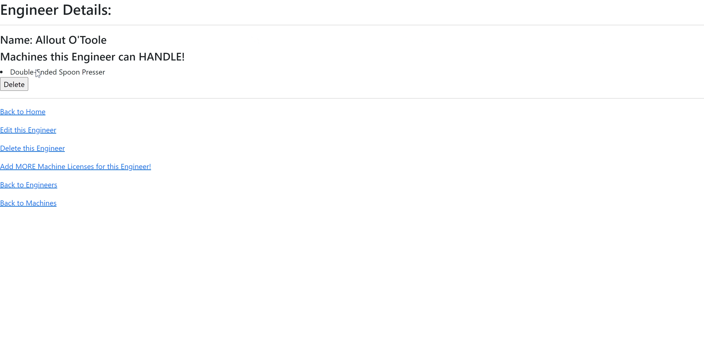

# Dr. Sillystringz's Factory


#### A web app for Epicodus's Week 10 Independent Code Review: Many-to-Many Relationships 

#### By Thomas McDowell

## Technologies Used:
* C#
* .NET 6.0
* MySql
* ASP.NET Core
* MVC
* Entity Framework Core
* Pomelo Entity Framework Core
* EF Core Migrations
* HTML Helpers

## Description:
This is a web app based on a prompt provided by Epicodus to demonstrate an understanding of Many-to-Many relationships in databases. A user should land on a splash page which prompts them to enter Engineers and Machines. As a user fills up the database, more Engineers and Machines will be added to the splash page list. A user can View Details, Edit, and Delete Engineers and Machines, and can Associate any given Machine with any Engineer and vice versa. These Associations can be deleted without deleting an entire Engineer or Machine. A user is unable to enter an Engineer or Machine without a name, and any given Engineer or Machine can't have more than one of the same kind of opposite associated with them (I.E. an Engineer can't be assigned the same Machine over and over and generate more associations). Similarly, no Engineer or Machine can be assigned a "blank" Machine or Engineer if their counterpart doesn't exist. 

## Setup/Installation Req's:
### Set Up and Run Project
1. Clone this repo.
2. Open the terminal and navigate to this project's production directory called "Factory".
3. Within the production directory "Factory", create a new file called `appsettings.json`.
4. Within `appsettings.json`, put in the following code, replacing the `uid` and `pwd` values with your own username and password for MySQL. For the LearnHowToProgram.com lessons, we always assume the `uid` is `root` and the `pwd` is `epicodus`.

```json
{
  "ConnectionStrings": {
      "DefaultConnection": "Server=localhost;Port=3306;database=factory;uid=[YOUR SQL USERNAME];pwd=[YOUR SQL PASSWORD];"
  }
}
```
5. Run ```dotnet watch run``` to view the project in your web browser. Enter your computer password when prompted.

### Set up the Databases

In your terminal- in the project directory (SillyStringz_Factory.Solution/Factory), run ```dotnet ef database update```


### INSTRUCTIONS:
Use the navigation links to move from page to page on the web app. Use text input fields to enter in the names of engineers and the designations of machines. Select menus and buttons will assign machines to engineers and vice versa.

## Known Bugs:
Nothing code-breaking on last sweep.

## License:
Git your license, yo!

## Database Structure

